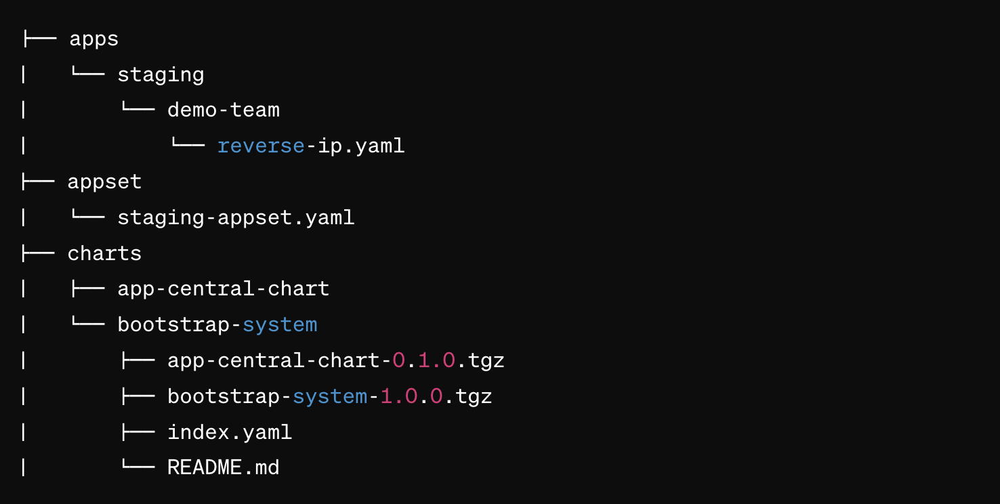

# helm-chart
# Cluster Bootstrap and Application Deployment Charts




## Overview
This repository includes two Helm charts:

- `bootstrap-system`: For initializing a Kubernetes cluster with essential components.
- `app-central-chart`: A versatile chart for deploying various applications by developers.

## Bootstrap System

The `bootstrap-system` chart includes components such as:
- `cluster-autoscaler`: For automatically adjusting the size of your cluster.
- `ingress-nginx`: For managing external access to services in your cluster.
- `kube-state-metrics`: For generating metrics about the state of Kubernetes objects.
- `metrics-server`: For aggregating resource usage data in your cluster.

Deployed using the App of Apps approach in ArgoCD, it sets up your cluster with these components out-of-the-box.

## App Central Chart

`app-central-chart` is designed for flexibility, allowing developers to deploy their services by simply customizing the values file. This prevents the need to create a new chart for each service.

## Application Values

Within the `apps` folder, developers will defind value files for applications to be deployed using `app-central-chart`. To deploy a new service, a developer needs to create a YAML file within this directory.

## Helm-chart Configuration
Use these values to configure your helmchart accordingly 

Parameter | Required | Description | Default
--------- | ----------- | ------- | -------
`fullnameOverride` | yes| Name of your deployment  | 
`image.repository` | yes | Docker image repository url<br><br>:information_source: If using with `image.registry` then just the repository name  |
`image.registry` | no | ECR url<br><br>:warning: Required when using `image.tag` |
`image.tag` | no | Docker image tag<br><br>:warning: Required when using `image.registry` |
`namespace` | yes | The namespace where your application will be deployed (This will be created if it doesn't exist) |
`containerPort` | yes | The port your application is running on |
`autoscaling.enabled` | yes | if set to `true` HPA is deployed for your application|
`autoscaling.minReplicas` | no | set min replicas for HPA |1
`autoscaling.maxReplicas` | no | set max replicas for HPA |6
`ingress.host` | yes | url of your application |
`ingress.annotations` | no | ingress annotations |
`replicaCount` | no | Number of replicas for your deployment | 2
`env.enabled` | yes | if set to `true` this will create a kubernetes secret |
`envFrom.secretRef.name` | yes | provide the name of your secret |
`resources.requests` | yes | set requests resources for your deployment | ```cpu:0.5 memory:500Mi```
`resources.limits` | yes | set limits resources for your deployment | ```cpu:1 memory:1Gi```
`lProbe.enabled` | yes | if set to `true` this will enable liveness probe |
`rProbe.enabled` | yes | if set to `true` this will enable Readiness probe |
`serviceAccount.enabled` | yes | if set to `true` this will create a serviceAccount for yor deployemt |
`serviceAccount.annotations` | no |  annotations for the serviceAccount |
`metadata.annotations` | no | if set, the value must be a flat JSON key/value |

